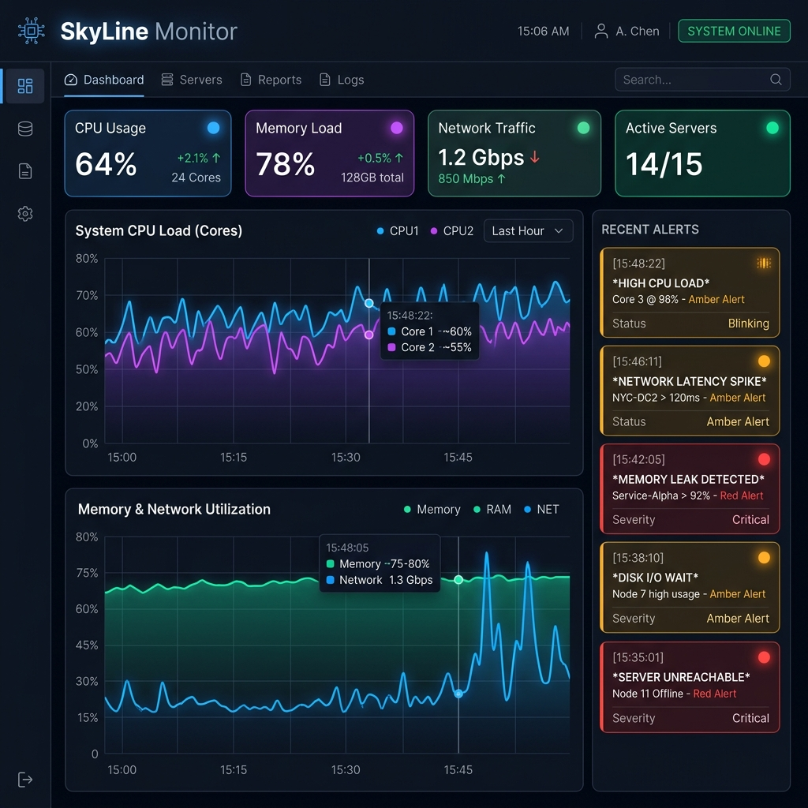
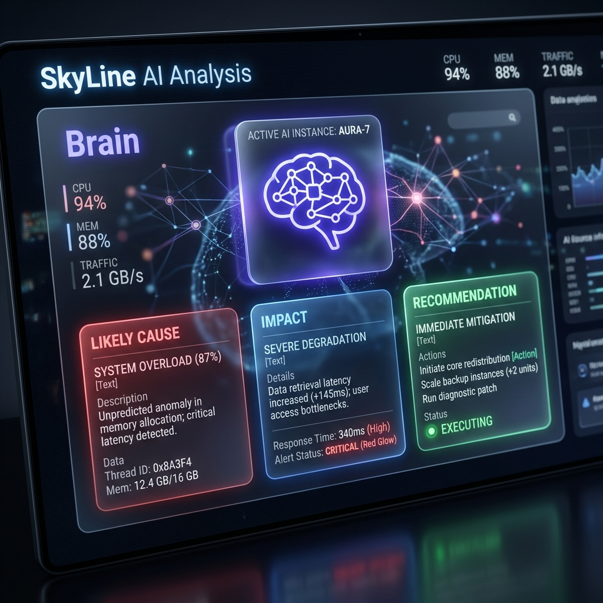

# SkyLine: Real-Time Monitoring Dashboard

SkyLine is a high-performance, full-stack monitoring dashboard designed for real-time system telemetry and AI-powered diagnostic analysis. Built with **Next.js**, **WebSockets**, and **Claude 3.5 Sonnet**, it provides an immediate, low-latency view of infrastructure health with an intelligence layer that explains anomalies as they happen.



## 🚀 Features

- **Live Streaming Telemetry**: Continuous metric updates (CPU, Memory, Traffic, Errors) via persistent WebSocket connections.
- **Automated Anomaly Detection**: Statistical rolling-window analysis that identifies performance spikes and system irregularities instantly.
- **AI-Powered Diagnostics**: Integrated Claude 3.5 Sonnet analysis that provides human-readable explanations for likely causes, system impact, and recovery recommendations.
- **Premium Dark UI**: A futuristic, data-dense interface designed for modern NOC (Network Operations Center) environments.

## 🧠 AI Analysis Engine

When an anomaly is detected, SkyLine doesn't just show you a red bar—it interprets the data. By feeding recent telemetry context to an LLM, it generates actionable insights in seconds.



## 🛠️ Technology Stack

- **Frontend**: Next.js 15 (App Router), Tailwind CSS, Recharts, Lucide Icons.
- **Backend**: Node.js, Express, WebSocket (`ws`).
- **Intelligence**: Anthropic Claude API (Sonnet 3.5).
- **Communication**: Full-duplex JSON streaming over WebSockets.

## 📂 Project Structure

```text
realtime-dashboard/
├── client/                 # Next.js Frontend
│   ├── app/                # App Router (Dashboard & API Proxy)
│   ├── components/         # Recharts & UI Components
│   ├── hooks/              # useWebSocket custom logic
│   └── services/           # AI Fetch Service
├── server/                 # Node.js Backend
│   ├── src/
│   │   ├── dataGenerator.js   # Metrics simulator
│   │   ├── anomalyDetector.js # Statistical analysis logic
│   │   ├── aiService.js       # Claude API integration
│   │   └── wsServer.js        # WebSocket broadcaster
│   └── app.js             # Express entry point
├── assets/                 # Project Mockups
└── workflow.md             # Detailed technical study guide
```

## 🚦 Quick Start

### 1. Prerequisites
- Node.js (v18+)
- Anthropic API Key

### 2. Environment Setup
Create a `.env` file in the root:
```env
PORT=4000
ANTHROPIC_API_KEY=your_key_here
NEXT_PUBLIC_WS_URL=ws://localhost:4000
NEXT_PUBLIC_API_URL=http://localhost:4000
```

### 3. Running the App
**Start Backend:**
```bash
cd server && npm start
```

**Start Frontend:**
```bash
cd client && npm run dev
```

---

## 📖 Learn More
For a deep dive into the architectural decisions, data flow, and logic patterns used in this project, please refer to the [Study Guide (workflow.md)](./workflow.md).
